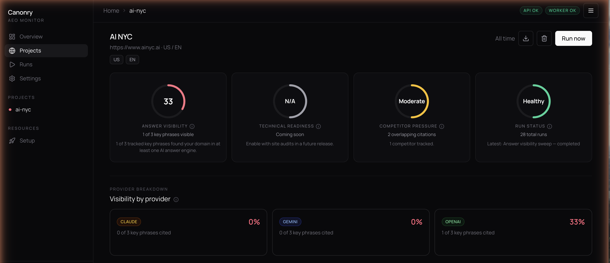

# Canonry 

[](https://www.npmjs.com/package/@ainyc/canonry) [](https://fsl.software/) [](https://nodejs.org)

**Open-source AEO monitoring for your domain.** Canonry tracks how AI answer engines (ChatGPT, Gemini, Claude, and others) cite or omit your website for the keywords you care about.

AEO (Answer Engine Optimization) is the practice of ensuring your content is accurately represented in AI-generated answers. As search shifts from links to synthesized responses, monitoring your visibility across answer engines is essential.



## Quick Start

```bash
npm install -g @ainyc/canonry
canonry init
canonry serve
```

Open [http://localhost:4100](http://localhost:4100) to access the web dashboard.

For CI or agent workflows, initialize non-interactively:

```bash
canonry init --gemini-key <key> --openai-key <key>
# or via environment variables:
GEMINI_API_KEY=... OPENAI_API_KEY=... canonry init
```

## Features

- **Multi-provider monitoring** -- query Gemini, OpenAI, Claude, and local LLMs (Ollama, LM Studio, or any OpenAI-compatible endpoint) from a single tool.
- **Three equal surfaces** -- CLI, REST API, and web dashboard all backed by the same API. No surface is privileged.
- **Config-as-code** -- manage projects with Kubernetes-style YAML files. Version control your monitoring setup.
- **Self-hosted** -- runs locally with SQLite. No cloud account, no external dependencies beyond the LLM API keys you choose to configure.
- **Scheduled monitoring** -- set up cron-based recurring runs to track citation changes over time.
- **Webhook notifications** -- get alerted when your citation status changes.
- **Audit logging** -- full history of every action taken through any surface.

## CLI Reference

All commands support `--format json` for machine-readable output.

### Setup

```bash
canonry init [--force]               # Initialize config and database (interactive)
canonry init --gemini-key <key>      # Initialize non-interactively (flags or env vars)
canonry bootstrap [--force]          # Bootstrap config/database from env vars only
canonry serve [--port 4100] [--base-path /prefix/]   # Start server (foreground)
canonry start [--port 4100] [--base-path /prefix/]   # Start server (background daemon)
canonry stop                         # Stop the background daemon
canonry settings                     # View active provider and quota settings
```

Non-interactive `init` flags: `--gemini-key`, `--openai-key`, `--claude-key`, `--local-url`, `--local-model`, `--local-key`, `--google-client-id`, `--google-client-secret`. Falls back to `GEMINI_API_KEY`, `OPENAI_API_KEY`, `ANTHROPIC_API_KEY`, `LOCAL_BASE_URL`, `LOCAL_MODEL`, `LOCAL_API_KEY`, `GOOGLE_CLIENT_ID`, `GOOGLE_CLIENT_SECRET` env vars.

### Projects

```bash
canonry project create <name> --domain <domain> --country US --language en
canonry project list
canonry project show <name>
canonry project delete <name>
```

### Keywords and Competitors

```bash
canonry keyword add <project> "keyword one" "keyword two"
canonry keyword list <project>
canonry keyword import <project> <file.csv>
canonry keyword generate <project> --provider gemini [--count 10] [--save]

canonry competitor add <project> competitor1.com competitor2.com
canonry competitor list <project>
```

### Visibility Runs

```bash
canonry run <project>                    # Run all configured providers
canonry run <project> --provider gemini  # Run a single provider
canonry run <project> --wait             # Trigger and wait for completion
canonry run --all                        # Trigger runs for all projects
canonry run show <id>                    # Show run details and snapshots
canonry runs <project>                   # List past runs
canonry status <project>                 # Current visibility summary
canonry evidence <project>               # View citation evidence
canonry history <project>                # Per-keyword citation timeline
canonry export <project>                 # Export project as YAML
```

### Config-as-Code

```bash
canonry apply canonry.yaml                   # Single project
canonry apply projects/*.yaml                # Multiple files
canonry apply multi-projects.yaml            # Multi-doc YAML (---separated)
```

### Scheduling and Notifications

```bash
canonry schedule set <project> --preset daily        # Use a preset
canonry schedule set <project> --cron "0 8 * * *"    # Use a cron expression
canonry schedule set <project> --preset daily --provider gemini openai
canonry schedule show <project>
canonry schedule enable <project>
canonry schedule disable <project>
canonry schedule remove <project>

canonry notify add <project> --webhook https://hooks.slack.com/... --events run.completed,citation.changed
canonry notify list <project>
canonry notify remove <project> <id>
canonry notify test <project> <id>
canonry notify events                    # List available event types
```

Schedule presets: `daily`, `weekly`, `twice-daily`, `daily@HH`, `weekly@DAY`.

### Provider Settings

```bash
canonry settings                         # Show all providers and quotas
canonry settings provider gemini --api-key <key>
canonry settings google --client-id <id> --client-secret <secret>
canonry settings provider local --base-url http://localhost:11434/v1 --model llama3
canonry settings provider openai --api-key <key> --max-per-day 1000 --max-per-minute 20
```

Quota flags: `--max-concurrent`, `--max-per-minute`, `--max-per-day`.

### Telemetry

```bash
canonry telemetry status                 # Show telemetry status
canonry telemetry enable                 # Enable anonymous telemetry
canonry telemetry disable                # Disable anonymous telemetry
```

Telemetry is automatically disabled when `CANONRY_TELEMETRY_DISABLED=1`, `DO_NOT_TRACK=1`, or a CI environment is detected.

## Config-as-Code

Define your monitoring projects in version-controlled YAML files:

```yaml
apiVersion: canonry/v1
kind: Project
metadata:
  name: my-project
spec:
  displayName: My Project
  canonicalDomain: example.com
  country: US
  language: en
  keywords:
    - best dental implants near me
    - emergency dentist open now
  competitors:
    - competitor.com
  providers:
    - gemini
    - openai
    - claude
    - local
```

Apply with the CLI or the API. Multiple projects can live in one file separated by `---`, or pass multiple files:

```bash
canonry apply canonry.yaml
canonry apply project-a.yaml project-b.yaml
```

```bash
curl -X POST http://localhost:4100/api/v1/apply \
  -H "Authorization: Bearer cnry_..." \
  -H "Content-Type: application/yaml" \
  --data-binary @canonry.yaml
```

Applied project YAML is declarative input. Runtime project/run data lives in the database, while local authentication and provider credentials live in `~/.canonry/config.yaml`.

## Provider Setup

Canonry queries multiple AI answer engines. Configure the providers you want during `canonry init`, or add them later via the settings page or API.

For authentication material, the local config file at `~/.canonry/config.yaml` is the source of truth. Provider API keys, Google OAuth client credentials, and Google OAuth tokens are stored there with file mode `0600`.

### Gemini

Get an API key from [Google AI Studio](https://aistudio.google.com/apikey).

### Google Search Console

Create OAuth client credentials in Google Cloud, then store them locally:

```bash
canonry settings google --client-id <id> --client-secret <secret>
```

After that, connect a project with:

```bash
canonry google connect <project> --type gsc
```

The web dashboard now supports the same flow:

- Configure Google OAuth once on the Settings page.
- Open a project and generate the Google consent link for that canonical domain.
- Select the matching Search Console property in the project dashboard.
- Queue syncs, inspect URLs, review inspection history, and review deindexed pages from the same project view.

### OpenAI

Get an API key from [platform.openai.com](https://platform.openai.com/api-keys).

### Claude

Get an API key from [console.anthropic.com](https://console.anthropic.com/settings/keys).

### Local LLMs

Any OpenAI-compatible endpoint works -- Ollama, LM Studio, llama.cpp, vLLM, and similar tools. Configure via `canonry init`, the settings page, or the CLI:

```bash
canonry settings provider local --base-url http://localhost:11434/v1
canonry settings provider local --base-url http://localhost:11434/v1 --model llama3
```

The base URL is the only required field. API key is optional (most local servers don't need one).

> **Note:** Unless your local model has web search capabilities, responses will be based solely on its training data. Cloud providers (Gemini, OpenAI, Claude) use live web search to ground their answers, which produces more accurate citation results. Local LLMs are best used for comparing how different models perceive your brand without real-time search context.

## API

All endpoints are served under `/api/v1/`. Authenticate with a bearer token:

```
Authorization: Bearer cnry_...
```

Key endpoints:

| Method | Path | Description |
|--------|------|-------------|
| `PUT` | `/api/v1/projects/{name}` | Create or update a project |
| `POST` | `/api/v1/projects/{name}/runs` | Trigger a visibility sweep |
| `GET` | `/api/v1/projects/{name}/timeline` | Per-keyword citation history |
| `GET` | `/api/v1/projects/{name}/snapshots/diff` | Compare two runs |
| `POST` | `/api/v1/apply` | Config-as-code apply |
| `GET` | `/api/v1/openapi.json` | OpenAPI spec (no auth required) |

## Web Dashboard

The bundled web dashboard provides five views:

- **Overview** -- portfolio-level visibility scores across all projects with sparkline trends.
- **Project** -- command center with score gauges, keyword evidence tables, and competitor analysis.
- **Runs** -- history of all visibility sweeps with per-provider breakdowns.
- **Settings** -- provider configuration, scheduling, and notification management.
- **Setup** -- guided wizard for first-time onboarding.

Access it at [http://localhost:4100](http://localhost:4100) after running `canonry serve`.

## Requirements

- Node.js >= 20
- At least one provider API key to run visibility sweeps (configurable after startup via the dashboard or CLI)
- A C++ toolchain for building `better-sqlite3` native bindings (only needed if prebuilt binaries aren't available for your platform)

### Native dependency setup

Canonry uses `better-sqlite3` for its embedded database. Prebuilt binaries are downloaded automatically for most platforms, but if `npm install` fails with a `node-gyp` error, you need to install build tools:

**macOS:**
```bash
xcode-select --install
```

**Debian / Ubuntu:**
```bash
sudo apt-get install -y python3 make g++
```

**Alpine Linux (Docker):**
```bash
apk add --no-cache python3 make g++ gcc musl-dev
```

**Windows:**
```bash
npm install -g windows-build-tools
```

If you're running in a minimal Docker image or CI environment without these tools, the install will fail. See the [better-sqlite3 troubleshooting guide](https://github.com/WiseLibs/better-sqlite3/blob/master/docs/troubleshooting.md) for additional help.

## Development

```bash
git clone https://github.com/ainyc/canonry.git
cd canonry
pnpm install
pnpm run typecheck
pnpm run test
pnpm run lint
pnpm run dev:web          # Run SPA in dev mode
```

## Deployment

See **[docs/deployment.md](docs/deployment.md)** for the full guide — local, reverse proxy (Caddy/nginx), sub-path, Tailscale, systemd, and Docker.

### Sub-path deployments

Serve canonry under a URL prefix without rebuilding:

```bash
canonry serve --base-path /canonry/
```

The server injects the base path at runtime — no build-time config needed.

### Docker Deployment

Canonry currently deploys as a **single Node.js service with a SQLite file on persistent disk**.

The repo includes a production `Dockerfile` and entry script. The default container entrypoint runs `canonry bootstrap` and then `canonry serve`.

```bash
docker build -t canonry .

docker run --rm \
  -p 4100:4100 \
  -e PORT=4100 \
  -e CANONRY_CONFIG_DIR=/data/canonry \
  -e GEMINI_API_KEY=your-key \
  -v canonry-data:/data \
  canonry
```

Published container images are available on Docker Hub:

- [Repository overview](https://hub.docker.com/repository/docker/arberx/canonry/general)
- [Available tags](https://hub.docker.com/repository/docker/arberx/canonry/tags)

```bash
docker pull arberx/canonry:latest
```

The same image is also published to GitHub Container Registry:

```bash
docker pull ghcr.io/ainyc/canonry:latest
```

Keep the container to a single replica and mount persistent storage at `/data` so SQLite and `config.yaml` survive restarts.

No CORS configuration is required for this Docker setup. The dashboard and API are served by the same Canonry process on the same origin. CORS only becomes relevant if you split the frontend and API onto different domains.

## Deploy on Railway or Render

Use the **repo root** as the service root. `@ainyc/canonry` depends on shared workspace packages under `packages/*`, so deploying from a subdirectory will break the build.

Canonry runs as a **single service** -- the API, web dashboard, and job scheduler all run in one process. No provider API keys are required at startup; configure them later through the web dashboard.

### Railway

[](https://railway.com/deploy/ENziH9?referralCode=0vODBs&utm_medium=integration&utm_source=template&utm_campaign=generic)

**One-click deploy:**

1. Click the button above (or create a service from this repo manually)
2. Railway builds the `Dockerfile` automatically -- no custom build or start commands needed
3. Right-click the service and select **Create Volume**, set the mount path to `/data`
4. Generate a public domain under **Settings > Networking** (port `8080`)
5. Open the dashboard and follow the setup wizard to configure providers and create your first project

**Manual setup:**

1. Create a new service from this GitHub repo
2. **Dockerfile Path**: `Dockerfile` (the default)
3. **Custom Build Command**: leave empty
4. **Custom Start Command**: leave empty
5. Add a **Volume** mounted at `/data` (right-click the service > Create Volume)
6. Generate a public domain under **Settings > Networking**
7. No environment variables are required to start -- the bootstrap creates a SQLite database and API key automatically

**Optional environment variables:**

| Variable | Description |
|----------|-------------|
| `GEMINI_API_KEY` | Google Gemini provider key |
| `OPENAI_API_KEY` | OpenAI provider key |
| `ANTHROPIC_API_KEY` | Anthropic/Claude provider key |
| `LOCAL_BASE_URL` | Local LLM endpoint (Ollama, LM Studio, etc.) |
| `CANONRY_API_KEY` | Pin a specific API key instead of auto-generating one |

Provider keys can also be configured at any time via the Settings page in the dashboard.

Keep the service to a **single replica** -- SQLite does not support concurrent writers.

### Render

Create one **Web Service** from this repo with runtime **Docker**, then attach a persistent disk mounted at `/data`.

- Leave build and start commands unset so Render uses the image `ENTRYPOINT`.
- Health check path: `/health`
- No environment variables are required at startup. Configure providers via the dashboard.

SQLite should live on the persistent disk, so keep the service to a single instance.

## Contributing

Contributions are welcome. See [CONTRIBUTING.md](./CONTRIBUTING.md) for setup instructions.

## License

[FSL-1.1-ALv2](./LICENSE) — Free to use, modify, and self-host. Each version converts to Apache 2.0 after two years.

---

Built by [AI NYC](https://ainyc.ai)
