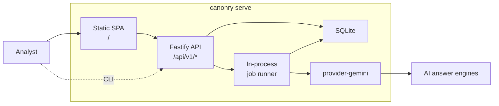

# Canonry

`canonry` is an open-source AEO (Answer Engine Optimization) monitoring tool. It tracks how AI answer engines cite or omit your domain for tracked keywords.

Built on the published [`@ainyc/aeo-audit`](https://www.npmjs.com/package/@ainyc/aeo-audit) package for technical audits.

## Quick Start

```bash
npm install -g @ainyc/canonry
canonry init
canonry serve
```

This starts a local server with a web dashboard at `http://localhost:4100`.

## CLI Usage

```bash
# Create a project and add keywords
canonry project create mysite --domain mysite.com --country US --language en
canonry keyword add mysite "emergency dentist brooklyn" "best dentist nyc"
canonry competitor add mysite competitor1.com competitor2.com

# Run a visibility sweep
canonry run mysite

# View results
canonry status mysite
canonry evidence mysite

# Config-as-code
canonry export mysite              # Export as canonry.yaml
canonry apply canonry.yaml         # Declarative apply
```

## What Lives Here

```text
apps/api/                 Cloud API entry point
apps/worker/              Cloud worker entry point
apps/web/                 Vite SPA source
packages/canonry/         Publishable npm package (CLI + server + bundled SPA)
packages/api-routes/      Shared Fastify route plugins
packages/contracts/       DTOs, enums, config-schema, error codes
packages/config/          Typed environment parsing
packages/db/              Drizzle ORM schema and migrations
packages/provider-gemini/ Gemini adapter
docs/                     Architecture, product plan, testing, ADRs
```

## Development

```bash
pnpm install
pnpm run typecheck
pnpm run test
pnpm run lint
```

Run the SPA in dev mode:

```bash
pnpm run dev:web
```

## Architecture



Locally: single Node.js process with SQLite. Cloud: separate API + Worker + Postgres. Same codebase, same API surface.

See [docs/architecture.md](./docs/architecture.md) for the full system view.

## Docs

- [Architecture](./docs/architecture.md)
- [Phase 2 design](./docs/phase-2-design.md)
- [Product plan](./docs/product-plan.md)
- [Testing guide](./docs/testing.md)
- [Workspace structure](./docs/workspace-packaging.md)
- [Site audit design](./docs/site-audit.md) (Phase 3)
- [Gemini provider design](./docs/providers/gemini.md)

## Relationship to `@ainyc/aeo-audit`

This repo consumes the published package as an external dependency. Technical audit logic is imported through explicit adapters in the worker. Do not vendor code from the audit package.
