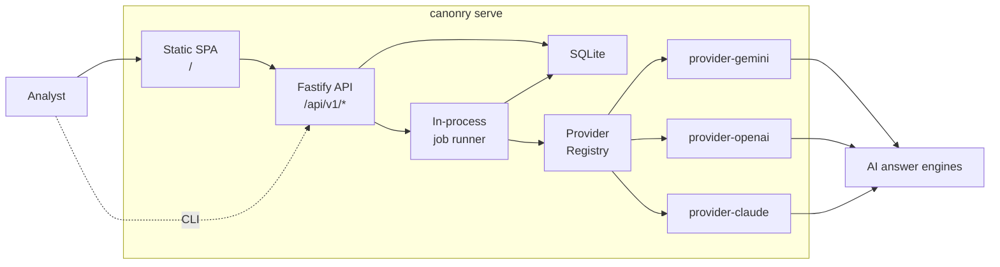

# Architecture

## Overview

Canonry is a self-hosted AEO monitoring application built on the published `@ainyc/aeo-audit` npm package. It tracks how AI answer engines (Gemini, OpenAI, and Claude) cite or omit a domain for tracked keywords.

## Local Architecture (Phase 2)

The local installation runs as a **single Node.js process** — no Docker, no Postgres, no message queue.

### Key components

- **`packages/canonry/`** — publishable npm package (`@ainyc/canonry`). Bundles CLI, Fastify server, job runner, and pre-built SPA.
- **`packages/api-routes/`** — shared Fastify route plugins. Used by both the local server and the cloud `apps/api/`.
- **`packages/db/`** — Drizzle ORM schema. SQLite locally, Postgres for cloud. Auto-migration on startup.
- **`packages/provider-gemini/`** — Gemini adapter: `executeTrackedQuery`, `normalizeResult`, retry with backoff.
- **`packages/provider-openai/`** — OpenAI adapter: Responses API with `web_search_preview` tool, URL annotation extraction.
- **`packages/provider-claude/`** — Claude adapter: Messages API with `web_search_20250305` tool, search result extraction.
- **`packages/contracts/`** — shared DTOs, enums, config-schema (Zod), error codes.
- **`apps/web/`** — Vite SPA source. Built and bundled into `packages/canonry/assets/`.

### Data flow

1. Analyst runs `canonry run <project>` (CLI) or triggers from the dashboard
2. API creates a run record and enqueues a job
3. Job runner fans out `executeTrackedQuery` for each keyword across all configured providers via the provider registry
4. Raw observation snapshots (`cited` / `not-cited`) are persisted per keyword per run
5. Transitions (`lost`, `emerging`) are computed at query time by comparing consecutive snapshots
6. Dashboard polls API for results and renders visibility data

## Cloud Architecture (Phase 4+)

| Concern | Local | Cloud |
|---------|-------|-------|
| Database | SQLite | Managed Postgres |
| Process model | Single process | API + Worker + CDN |
| Job queue | In-process async | pg-boss |
| Auth | Auto-generated local key | Bootstrap endpoint + team keys |
| Web hosting | Fastify static | CDN |

The same API routes, contracts, Drizzle schema, and dashboard code are used in both modes. The cloud deployment replaces the single-process server with separate services.

## Service Boundaries

- **`@ainyc/aeo-audit`** — external npm dependency. Technical audit engine, CLI, formatters.
- **`packages/api-routes/`** — HTTP surface, validation, orchestration, read APIs.
- **`packages/canonry/`** — CLI, local server, job runner (the publishable artifact).
- **`packages/provider-gemini/`** — Gemini provider adapter and normalization layer.
- **`packages/provider-openai/`** — OpenAI provider adapter and normalization layer.
- **`packages/provider-claude/`** — Claude provider adapter and normalization layer.
- **`packages/db/`** — schema, migrations, database access.
- **`packages/contracts/`** — DTOs, enums, config validation, error codes.
- **`packages/config/`** — typed environment parsing.
- **`apps/api/`** — cloud API entry point (imports `packages/api-routes/`).
- **`apps/worker/`** — cloud worker entry point.
- **`apps/web/`** — SPA source code.

## Design Constraints

- This repo remains independent from the audit package repo
- Consume only published `@ainyc/aeo-audit` releases
- Same auth path for local and cloud (API key-based)
- Raw observation snapshots only; transitions computed at query time
- Visibility-only in Phase 2; site audit deferred to Phase 3

## Score Families

- **Answer visibility**: multi-provider keyword tracking and citation outcomes across Gemini, OpenAI, and Claude (Phase 2)
- **Technical readiness**: `@ainyc/aeo-audit` and future site-audit rollups (Phase 3)

These remain separate to avoid mixing technical readiness with live-answer visibility.
