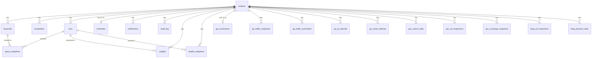

# Data Model

Source of truth: `packages/db/src/schema.ts`

## Entity Relationships

## Table Groups

### Core Domain

| Table | Purpose | Key Constraints |
|-------|---------|----------------|
| **projects** | Root entity — domain, location config, provider list | Unique: `name` |
| **keywords** | Tracked keywords per project | Unique: `(projectId, keyword)` |
| **competitors** | Competitor domains per project | Unique: `(projectId, domain)` |
| **runs** | Visibility sweep executions | FK: projectId → projects |
| **query_snapshots** | Per-keyword per-provider results | FK: runId → runs, keywordId → keywords |
| **schedules** | Cron schedules (1:1 with project) | Unique: projectId |
| **notifications** | Alert configurations per project | FK: projectId → projects |
| **audit_log** | Change tracking | FK: projectId → projects (optional) |

### Integrations — Google

| Table | Purpose |
|-------|---------|
| **google_connections** | OAuth credentials, domain-scoped. Unique: `(domain, connectionType)` |
| **gsc_search_data** | GSC search analytics data synced per run |
| **gsc_url_inspections** | URL inspection results from GSC |
| **gsc_coverage_snapshots** | Index coverage snapshots from GSC |

### Integrations — Bing

| Table | Purpose |
|-------|---------|
| **bing_connections** | API credentials, domain-scoped. Unique: `domain` |
| **bing_url_inspections** | URL inspection results from Bing |
| **bing_keyword_stats** | Keyword performance data from Bing |

### Integrations — Google Analytics

| Table | Purpose |
|-------|---------|
| **ga_connections** | GA4 property connection (1:1 with project) |
| **ga_traffic_snapshots** | Traffic data snapshots |
| **ga_traffic_summaries** | Aggregated traffic summaries |
| **ga_ai_referrals** | AI engine referral tracking. Unique: `(projectId, date, source, medium, sourceDimension)` |
| **ga_social_referrals** | Social media referral tracking. Unique: `(projectId, date, source, medium, channelGroup)` |

### Intelligence

| Table | Purpose |
|-------|---------|
| **insights** | Per-run analysis insights (regressions, gains). FK: projectId → projects, runId → runs |
| **health_snapshots** | Citation health snapshots per run. FK: projectId → projects, runId → runs |

### System

| Table | Purpose |
|-------|---------|
| **api_keys** | API authentication. Unique: `keyHash` |
| **usage_counters** | Rate limiting and usage tracking. Unique: `(scope, period, metric)` |

## JSON Columns

Several text columns store serialized JSON. Always use `parseJsonColumn()` from `@ainyc/canonry-db`:

| Table.Column | Expected Shape |
|-------------|---------------|
| `projects.locations` | `LocationContext[]` |
| `projects.providers` | `string[]` |
| `projects.tags` | `string[]` |
| `projects.labels` | `Record<string, string>` |
| `projects.ownedDomains` | `string[]` |
| `query_snapshots.citedDomains` | `string[]` |
| `query_snapshots.groundingSources` | `GroundingSource[]` |
| `query_snapshots.competitorOverlap` | `string[]` |
| `insights.recommendation` | `{ action: string; detail?: string }` |
| `insights.cause` | `{ category: string; detail?: string }` |
| `health_snapshots.providerBreakdown` | `Record<string, { total: number; cited: number; rate: number }>` |

## Conventions

- All IDs are text (UUIDs generated with `crypto.randomUUID()`).
- All timestamps are ISO 8601 text strings.
- All project-owned tables cascade delete when the project is deleted.
- Google/Bing connections are domain-scoped (not project-scoped) to support multiple projects per domain.
- GA4 connections are project-scoped (1:1).
